# <span id="head1"> DataCon2020</span>
DataCon2020大数据安全分析大赛，🏆【方向五】恶意代码分析冠军源码和方案。

- [ DataCon2020](#head1)
	- [ 最终排名（部分）](#head2)
	- [ 赛题回顾](#head3)
	- [ 启发与思路](#head4)
	- [ 算法与模型](#head5)
		- [ 灰度图](#head6)
		- [ 直方图](#head7)
		- [ PE静态特征模型](#head8)
		- [ 特征工程](#head9)
			- [ Section信息](#head10)
			- [ 字符匹配](#head11)
			- [ Yara匹配](#head12)
			- [ Opcode](#head13)
			- [ 其他布尔信息](#head14)
		- [ 函数名（CG图）](#head15)
		- [ 复赛模型融合](#head16)
	- [ 结果与改进](#head17)
		- [ 复赛结果](#head18)
		- [ 改进方向](#head19)
	- [ 团队介绍](#head20)
	- [ 参考资料](#head21)

## <span id="head2"> 最终排名（部分）</span>

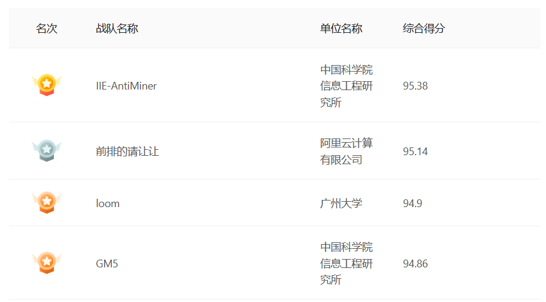

## <span id="head3"> 赛题回顾</span>

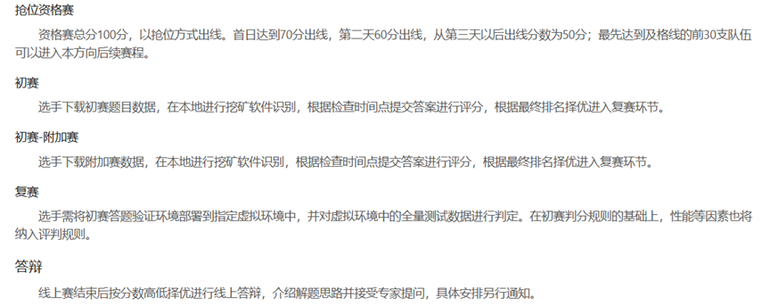

## <span id="head4"> 启发与思路</span>

* [挖矿软件常见套路][1]
* 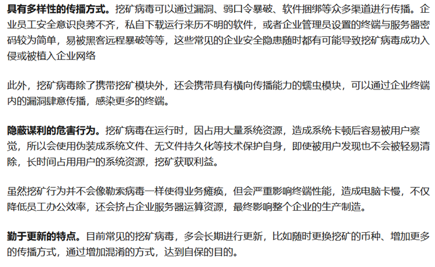

* 资格赛中获得的启发

  * ①~②：需要关注虚拟机、调试软件、反编译软件、逆向分析工具和杀软名
  * ③~⑤：需要关注系统关键路径、注册表
  * ⑥~⑦：需要关注域名、IP、端口、钱包地址、可见字符串
  * ⑧~⑩：同③~⑤
* 逆向工程中得到的思路

  * 通过逆向分析，发现许多样本函数名包含数据货币名、密码学算法名（哈希算法）。
  * 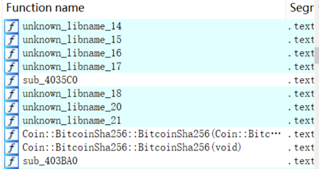
  * 很多带壳样本：UPX、Pelite、VMP……
  * 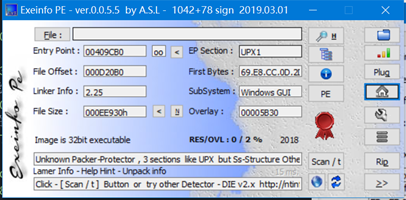
  * 白样本含有很多其他类别恶意程序，如病毒、外挂……
  * 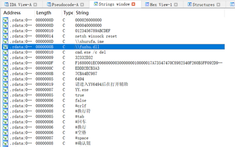

## <span id="head5"> 算法与模型</span>

> 复赛环境搭建说明：[setup.txt](setup.txt)

> 复赛预处理脚本：[run.py](run.py)

> 复赛测试脚本：[test.py](test.py)

> 复赛一键验证测试脚本：[run.sh](run.sh)

本次初赛、附加赛与复赛我们队使用的五种算法或模型如下（其中在复赛中因为有性能的需求，部分模型未使用）：

### <span id="head6"> 灰度图</span>

PE文件二进制每一个字节对应一个像素，最后缩放成固定大小的灰度图。这是最常见也容易实现的模型，在恶意代码检测中已经广泛使用。

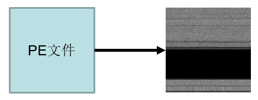

但我们仅在初赛时使用，原因如下：

* 文件大小差异较大，缩放比例不一致。
* 给定的样本集中包含许多加壳样本，使得数据分布被打乱，黑白特征不明显。
* 预处理时间较长。

>  初赛时部分代码：[old/gray.ipynb](old/gray.ipynb)

### <span id="head7"> 直方图</span>

这也是除了灰度图外一种不需要解析PE文件格式来进行提取学习的特征方法，我们主要使用两类直方图：

* 字节直方图：统计字节0-255出现个数
* [字节熵直方图][2]：
  * 滑动一个1024字节的窗口，步长为256字节
  * 计算每个1024字节窗口的熵
  * 统计滑动窗口的（字节，熵值）对，最后转换成1x256维的特征向量
  * 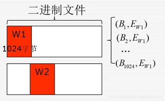

最后连接这两个特征向量，使用深度学习模型学习。效果好，预处理快，初赛单用这个模型便拿到`93.8425`分。

> 预处理和验证可见本节一开始提到的脚本。

> 复赛时的模型训练代码：[train_histogram.py](train_histogram.py)

### <span id="head8"> PE静态特征模型</span>

虽然提供的样本被抹掉了样本PE结构中的MZ、PE、导入导出表等信息，但我们只需要恢复`MZ`头和`PE\0\0`即可使用常规的分析工具对PE样本进行分析。

因为恢复也只是能解析PE文件的静态格式和特征，并不能将其运行，所以只能从静态特征入手。最后我们使用的是著名[EMBER][3]数据集提到的PE文件静态特征提取方法。虽然原文用于检测恶意Windows PE文件，但是我们也将其移植过来检测挖矿软件。

原始方法提取了许多PE文件静态特征，如下：

- [x] ByteHistogram、ByteEntropyHistogram：直方图
- [x] GeneralFileInfo：调试信息、TLS段、重定位信息……
- [x] HeaderFileInfo：PE头基本所有信息
- [x] ExportsInfo：导出表个数、名称
- [x] SectionInfo：Section名、大小、熵、属性等……
- [ ] ImportsInfo：导入表被破坏，无法解析导入函数信息
- [ ] StringExtractor：字符串提取在特征工程里做，这里删掉一是为了节省时间，二是防止特征重叠

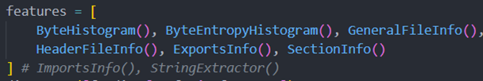

> 预处理和验证可见本节一开始提到的脚本。

> 复赛时的模型训练代码：[train_pe_raw.py](train_pe_raw.py)

### <span id="head9"> 特征工程</span>

我们队所用特征工程主要包括五部分，分别为：Section信息、字符匹配、Yara匹配、Opcode和其他布尔信息。

> 预处理和验证可见本节一开始提到的脚本。

> 复赛时的模型训练代码：[feature_engineering.py](feature_engineering.py)

#### <span id="head10"> Section信息</span>

节区特征是PE文件一种重要特征，过多的节区、异常的节区名、异常的资源节区个数等指标都可以指示这个PE文件的可疑程度，因此我们首先针对节区进行特征统计：

* OEP所在节区名长度
  * OEP所在节区名一般为`.text`，如果过长或过短说明很可能被混淆
  * 比如UPX壳OEP处节区名为`UPX1`。
* 各可读、可写、可执行节区大小和熵，和各属性节区占文件大小比例
  * 举例：如果可执行节区占比过小，很可能加壳了（压缩壳）
* 资源节区个数
  * 资源节区一般藏又一些压缩数据，比如挖矿恶意载荷
* 节区总个数
  * 恶意软件节区数一般比较多

```Python
# OEP处section名长度
section_info["entry"] = len(entry_section)
section_info["section_num"] = len(lief_binary.sections)
# 可读、可写、可执行sections大小均值
sR, sW, sX = [], [], []
# 可读、可写、可执行sections熵值均值
entrR, entrW, entrX = [], [], []
# 资源section个数
rsrc_num = 0
for s in lief_binary.sections:
    props = [str(c).split('.')[-1] for c in s.characteristics_lists]
    if "MEM_READ" in props:
        sR.append(s.size)
        entrR.append(s.entropy)
    if "MEM_WRITE" in props:
        sW.append(s.size)
        entrW.append(s.entropy)
    if "MEM_EXECUTE" in props:
        sX.append(s.size)
        entrX.append(s.entropy)
    if 'rsrc' in s.name:
        rsrc_num += 1
section_info['size_R'], section_info['size_W'], section_info['size_X'] = np.mean(sR), np.mean(sW), np.mean(sX)
section_info['entr_R'], section_info['entr_W'], section_info['entr_X'] = np.mean(entrR), np.mean(entrW), np.mean(entrX)
section_info['rsrc_num'] = rsrc_num
```

#### <span id="head11"> 字符匹配</span>

根据资格赛获得的启发，队员们手写相应的正则匹配模式，其中包括

* 路径、注册表、URL、IP地址正则匹配
  * 其中因为注册表正则模式存在回溯问题，有的样本存在特别长的字符串，导致一个样本可能匹配了八分钟，所以我们复赛简单粗暴改成匹配字符串”reg”。主要原因是我们认为操作注册表必然存在相应函数，而这些函数名基本含有”reg”。
* 比特币钱包地址正则匹配
  * 主要写了三种货币：比特币、莱特币、门罗币
* 一些重要字符串匹配
  * ”MZ”、”PE”指示可能含别的PE文件
  * ”pool”、”cpu”、”gpu”、”coin”则是我们认为挖矿软件普遍存在的字符串

```Python
self.path_pattern = re.compile(b'[C-Zc-z]:(?:(?:\\\\|/)[^\\\\/:*?"<>|"\x00-\x19\x7f-\xff]+)+(?:\\\\|/)?')
self.regs_pattern = re.compile(b'reg', re.IGNORECASE)# re.compile(b'[A-Z_ ]{5,}(?:\\\\[a-zA-Z ]+)+')
self.urls_pattern = re.compile(b'https?://(?:[-\w.]|(?:%[\da-fA-F]{2}))+')
# self.strings_pattern = re.compile(b'[\x20-\x7f]{5,}')
self.ip_pattern = re.compile(b'(?:(?:25[0-5]|2[0-4]\d|[01]?\d{1,2})\.){3}(?:25[0-5]|2[0-4]\d|[01]?\d{1,2})')
​
# #比特币钱包地址
self.wallet_pattern_btc = re.compile(b'(?:1|3|bc1|bitcoincash:q)(?:(?![0OIi])[0-9A-Za-z]){25,34}')
self.wallet_pattern_ltc = re.compile(b'(?:ltc1|M|L)[A-Za-z0-9]{25,36}')
self.wallet_pattern_xmr = re.compile(b'[0-9A-Za-z]{90,100}') #门罗币
​
self.mz_pattern = re.compile(b'MZ')
self.pe_pattern = re.compile(b'PE')
self.pool_pattern = re.compile(b'pool', re.IGNORECASE)
self.cpu_pattern = re.compile(b'cpu', re.IGNORECASE)
self.gpu_pattern = re.compile(b'gpu', re.IGNORECASE)
self.coin_pattern = re.compile(b'coin', re.IGNORECASE)
```

#### <span id="head12"> Yara匹配</span>

Yara规则是基于二进制文件中包含的文本或二进制字符串的描述创建的。我们首先使用[Yara-Rules][4]提供的规则进行匹配，其中包括：

* [壳规则](rules/packer.yar)

  * 包含许多已知壳的Yara匹配规则

* [密码学常量规则](rules/crypto_signatures.yar)

  * 特别是哈希算法初始值
  * 匹配时间略长，复赛忍痛舍弃

最后我们还使用了[yarGen][5]工具，提取**训练集黑样本**特征，其原理是先解析出样本集中的共同的字符串，然后经过白名单库的过滤，最后通过启发式、机器学习等方式筛选出最优的Yara规则。根据得到的Yara规则集结果，选择匹配度大于某一阈值的规则形成新的规则集，查看匹配黑白样本的分布比例，筛选部分白样本规则。通过不断的调整阈值参数与筛除比例，在尽可能泛化的同时匹配到更多的黑样本，最后人工结合挖矿特征筛选出更值得关注的部分，优化规则集。

最终得到的[自定义Yara规则集](rules/rule20.yar)阈值为20，即每条规则在**训练集黑样本**中匹配样本个数大于等于20。

#### <span id="head13"> Opcode</span>

通过传统逆向工具解析PE文件中的函数实在太耗时，因此我们打算通过简单的正则搜索识别代码中的函数，然后提取函数片段中的Opcode并保存。例如x86下，按栈匹配`push ebp; mov ebp, esp; ……; ret`如下代码段。

```Python
self.m32_pat = re.compile(b'\x55\x8b\xec[^\xc3]*\xc3')
# …………
all_functions = self.m32_pat.findall(binary)
for function in all_functions:
    function_op = []
    for _, _, mnemonic, _ in self.md32.disasm_lite(function, 0x0):
        try:
            function_op.append(self.opcode_dict[mnemonic])
        except Exception:
            break
    else:
        op_pattern.append(function_op)
```

原因是发现在挖矿样本中有大量样本间共有的opcode特征，而白样本中却不明显。因此可以统计匹配出的函数个数、opcode种类个数、平均值、方差等特征。

#### <span id="head14"> 其他布尔信息</span>

根据资格赛所提供的启发，我们还收集了各种类别的进程名、数字货币名、密码学算法名等信息，并将它们存储在`./data`中，以检测它们是否在给定PE文件内，具体如下表所示。

| 文件名            | 注释                          |
| ----------------- | ----------------------------- |
| algorithm.txt     | 常见密码学算法名              |
| av.json           | [常见的杀毒软件的进程名称][6] |
| coin.txt          | 数字货币名                    |
| dbg.txt           | 调试器名                      |
| domain_suffix.txt | 常见顶级域名（复赛时未使用    |
| OPCODE.txt        | Opcode词汇表                  |
| pool.txt          | [常见矿池二级域名][7]         |
| vm.txt            | 虚拟机内软件名                |

我们搜集了常见的杀毒软件的进程名称，以此作为挖矿软件对杀毒软件的检测行为的特征。

考虑到挖矿软件需要反分析、反调试来保证持久化，我们还以常见的调试器进程名作为挖矿软件的反调试行为的特征，主要为我们日常使用的调试工具。

考虑到挖矿软件会进行反沙箱对抗，我们搭建了各种不同的虚拟机软件环境，整理了挖矿软件可能检测的虚拟机环境特征。
由于挖矿过程必然存在矿池，因此我们想到检测矿池二级域名来作为挖矿软件的一个有效特征，于是编写了爬虫脚本通过正则匹配的方式爬取了目前常用的矿池域名300余条。

### <span id="head15"> 函数名（CG图）</span>

借鉴一篇[论文][8]的思路，处理流程如下：

1. IDA Pro提取函数调用生成GDL(Graph Description Language)文件
2. GDL文件包含函数名（结点）、调用关系（边），如下述代码段所示
3. 这样可以对函数调用次数进行排序，作为一种序列信息进行训练

```Yaml
graph: {
title: "Building graph"
// IDA palette
// ....
colorentry 71: 255 255 0
colorentry 72: 0 0 0
colorentry 73: 0 0 0
colorentry 74: 0 0 0
colorentry 75: 0 255 255
colorentry 76: 192 192 192
// ....
node: { title: "165" label: "__aulldiv" color: 75 textcolor: 73 bordercolor: black }
node: { title: "166" label: "__aulldvrm" color: 75 textcolor: 73 bordercolor: black }
node: { title: "167" label: "__aullshr" color: 75 textcolor: 73 bordercolor: black }
// ....
// node 169
edge: { sourcename: "169" targetname: "135" }
edge: { sourcename: "169" targetname: "136" }
edge: { sourcename: "169" targetname: "170" }
edge: { sourcename: "169" targetname: "171" }
// ....
}
```

初赛使用效果不错，复赛因IDA Pro耗时过长放弃。

> 初赛时部分代码路径：[old/cg](old/cg)

### <span id="head16"> 复赛模型融合</span>

这方面我们队员涉猎较少，可能选择的模型和融合的方式还有改进的空间，欢迎各位看客交流学习。

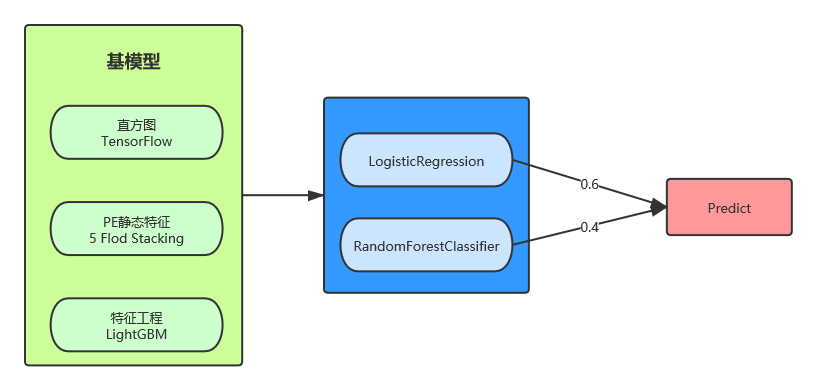

## <span id="head17"> 结果与改进</span>

### <span id="head18"> 复赛结果</span>

在判分前主办方提供了1k个测试样本，我们使用这1k个样本进行检验与测试，最终耗时大约为`1min20s`，得分为`95.52`分。

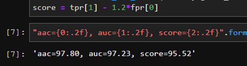

因此预估判分用的1w多个样本耗时在`20min`上下，扣掉0.2分后与最终的`95.38`十分接近，证明了我们所用方法泛化能力以及稳定性。

### <span id="head19"> 改进方向</span>

* 特征工程中我们提取的Opcode序列仅用了统计特征，我们也可以将其当作一种序列信息，使用NLP方法训练学习。

* 提供的样本中还是含有很多加壳样本的，因此我们可以对Yara匹配出的加壳样本进行单独处理。

* 特征工程的完善，例如：
  * 任务计划名: Drivers、WebServers、DnsScan
  * Powershell、Vbs脚本
  * 端口，特别是高端口（>10000）
  * ……

## <span id="head20"> 团队介绍</span>

本战队所在的信工所六室威胁情报与威胁发现团队主要针对在线流量、落地样本（载荷）、安全日志、威胁情报等网络空间典型威胁数据进行分析，研究威胁情报智能处理、对抗性恶意代码分析、可疑网络/终端行为检测挖掘的技术与系统，培养具备高级威胁对抗分析技能的人才。同时，团队还建设和运营了国家网络空间威胁情报共享开放平台CNTIC（公众号cntic2017）, 研制了大规模恶意代码智能分析平台iMAS 以及网络恶意通信检测系统，均已应用于国家有关部门和地区的实际工作中。我们欢迎保研生、实习生加入，联系方式jiangzhengwei#iie.ac.cn。

## <span id="head21"> 参考资料</span>

1. [挖矿软件常见套路](https://zhuanlan.zhihu.com/p/164557943)
2. [Deep Neural Network Based Malware Detection Using Two Dimensional Binary Program Features](https://arxiv.org/pdf/1508.03096.pdf)
3. [EMBER: An Open Dataset for Training Static PE Malware Machine Learning Models](https://arxiv.org/abs/1804.04637)
4. [Yara-Rules / rules](https://github.com/Yara-Rules/rules)
5. [Neo23x0 / yarGen](https://github.com/Neo23x0/yarGen)
6. [BrownFly / findAV](https://github.com/BrownFly/findAV)
7. [Mining Pools Live Monitoring Tools](https://investoon.com/mining_pools)
8. [DeepCG: Classifying Metamorphic Malware Through Deep Learning of Call Graphs](https://www.researchgate.net/publication/337954044_DeepCG_Classifying_Metamorphic_Malware_Through_Deep_Learning_of_Call_Graphs)

[1]: https://zhuanlan.zhihu.com/p/164557943	"挖矿软件常见套路"
[2]: https://arxiv.org/pdf/1508.03096.pdf	"Deep Neural Network Based Malware Detection Using Two Dimensional Binary Program Features"
[3]: https://arxiv.org/abs/1804.04637	"EMBER: An Open Dataset for Training Static PE Malware Machine Learning Models"
[4]: https://github.com/Yara-Rules/rules	"Yara-Rules / rules"
[5]: https://github.com/Neo23x0/yarGen	"Neo23x0 / yarGen"
[6]: https://github.com/BrownFly/findAV	"BrownFly / findAV"
[7]: https://investoon.com/mining_pools	"Mining Pools Live Monitoring Tools"
[8]: https://www.researchgate.net/publication/337954044_DeepCG_Classifying_Metamorphic_Malware_Through_Deep_Learning_of_Call_Graphs	"DeepCG: Classifying Metamorphic Malware Through Deep Learning of Call Graphs"
